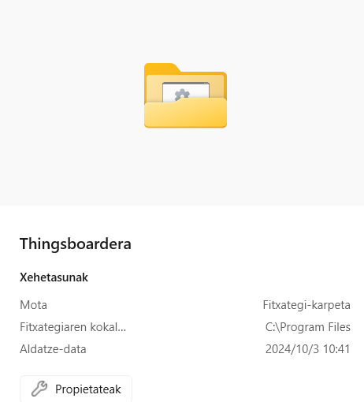
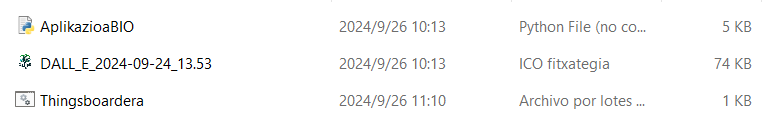
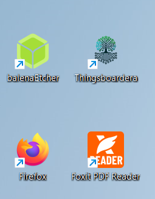

# THINGSBOARD-era

Exekutagarri honek `.csv` artxiboak Thingsboard-era igotzen ditu. **“Zuhaitza” Tenant**-aren barnean gordetzen ditu telemetria guztiak. 

## Aurrebaldintzak

Exekutagarria instalatzeko, beharrezkoa da:

- Python 3 instalatuta izatea.
- `pandas` eta `requests` liburutegiak instalatuta izatea.

## Instalazio Instrukzioak

1. **Karpeta Sortu**  
   `c:/ProgramFiles` karpetan **Thingsboardera** izeneko karpeta sortu.


   
2. **Fitxategiak Kopiatu**  
   `Thingsboardera.bat`, `DALL_E_2024-09-24_13.53.ico`, `AplikazioaBIO.py`, eta `readme.md` fitxategiak karpeta horretan gorde.



3. **Lasterbidea Sortu**  
   `Thingsboardera.bat` artxiboaren lasterbide bat sortu mahaigainean.
   
4. **Ikonoa Ezarri**  
   Lasterbideari `DALL_E_2024-09-24_13.53.ico` ikonoa ezarri.



## EXCEL Artxiboak Prestatzeko

1. **EXCEL Artxiboa Editatu**  
   EXCEL artxiboa hartu eta lehen 4 lerroak eta marrazkia ezabatu.
   
2. **"ts" Zutabea Sortu**  
   Ezkerrean zutabe berri bat sortu `"ts"` izenarekin.
   
3. **Formula Aplikatu**  
   Hurrengo formula erabili:

   ```excel
   =INT(B2 - DATA(1970; 1; 1)) * 86400 + MOD(B2; 1) * 86400

4. **csv formatuan gorde**  
   Ezkerrean zutabe berri bat sortu `"ts"` izenarekin.
